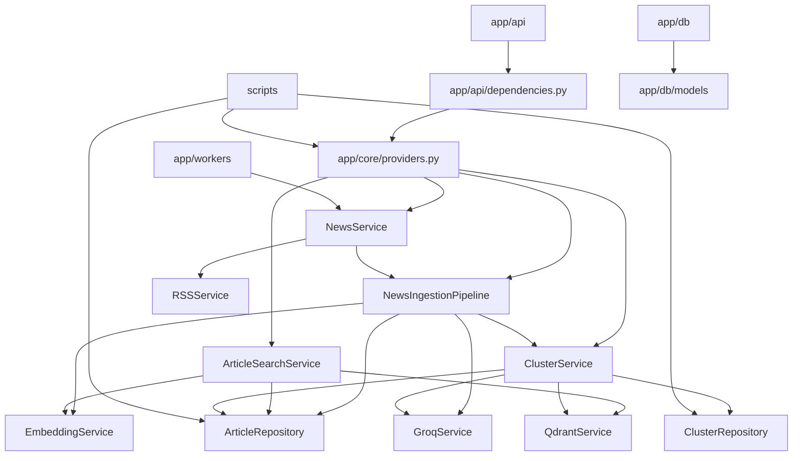
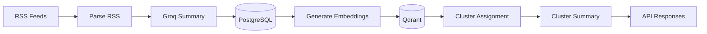

# NewsLens Architecture

## 1. Folder Structure

```text
app/
  api/
    dependencies.py
    v1/
      health.py
      articles.py
      clusters.py
  core/
    config.py
    constants.py
    logger.py
    providers.py
    rss_feeds.py
  db/
    base.py
    session.py
    models/
      article.py
      cluster.py
  repositories/
    article_repository.py
    cluster_repository.py
  services/
    news/
      news_service.py
      ingestion_pipeline.py
      rss_service.py
      schemas.py
    clustering/
      cluster_service.py
      schemas.py
    embeddings/
      embedding_service.py
      qdrant_service.py
    llm/
      groq_service.py
      prompts.py
    search/
      article_search_service.py
  workers/
    scheduler.py
scripts/
alembic/
```

## 2. Folder Responsibilities

- `app/api`: HTTP transport layer and request/response orchestration.
- `app/core`: shared configuration, constants, logging, and dependency providers.
- `app/db`: SQLAlchemy engine/session setup and ORM models.
- `app/repositories`: all database queries and ORM persistence operations.
- `app/services`: application use cases and infrastructure-facing service wrappers.
- `app/workers`: background scheduling and job execution.
- `scripts`: operator utilities for ingestion, reset, backfill, and validation.
- `alembic`: schema migrations.

## 3. Service Responsibilities

### News Service

- Fetch RSS articles.
- Orchestrate ingestion at a high level.
- Count inserted versus skipped articles.
- Never issue SQLAlchemy queries.

### News Ingestion Pipeline

- Check for duplicates.
- Generate summaries.
- Persist articles via repositories.
- Generate embeddings.
- Delegate clustering to `ClusterService`.
- Keep the workflow readable as an English-like sequence.

### RSS Service

- Parse RSS feeds.
- Normalize feed entries into parsed article DTOs.
- Never touch the database.

### Embedding Service

- Load the sentence-transformer model.
- Generate embeddings for arbitrary text.
- Generate article embeddings from article content.

### Qdrant Service

- Create and manage the vector collection.
- Upsert vectors.
- Search nearest neighbors.
- No business logic.

### Groq Service

- Call Groq chat completions.
- Generate article summaries.
- Generate cluster summaries.
- Prompt text lives in `services/llm/prompts.py`.

### Cluster Service

- Find similar articles in Qdrant.
- Determine cluster assignment.
- Update cluster records.
- Generate cluster summaries.
- Use repositories for persistence access.

### Article Search Service

- List articles.
- Search articles by text.
- Fetch articles by id.
- Perform semantic search through embeddings and Qdrant.

## 4. Repository Responsibilities

### Article Repository

- `get_by_id()`
- `get_by_url()`
- `exists()`
- `create()`
- `update_cluster()`
- `assign_cluster()`
- `search()`
- `list_articles()`
- `list_all()`
- `list_unclustered()`
- `get_by_ids()`
- `clear_clusters()`

### Cluster Repository

- `create()`
- `get_by_id()`
- `list_clusters()`
- `get_articles()`
- `update_summary()`
- `delete_all()`

## 5. End-to-End Ingestion Pipeline

1. RSS feeds are fetched and parsed.
2. Parsed articles are passed to `NewsService`.
3. `NewsIngestionPipeline` checks whether an article already exists.
4. A summary is generated with Groq.
5. The article is stored in PostgreSQL.
6. An embedding is generated from the article text.
7. The vector is upserted into Qdrant.
8. Nearest neighbors are searched in Qdrant.
9. A cluster is assigned or reused.
10. Cluster summaries are generated or refreshed.
11. The API exposes the resulting data.

## 6. Dependency Graph



## 7. Request Lifecycle

1. FastAPI receives a request.
2. Route-level dependencies resolve a DB session and the appropriate service.
3. The route calls the service.
4. The service uses repositories and infrastructure clients.
5. Repositories perform ORM work.
6. The route serializes ORM models into Pydantic response schemas.

## 8. Data Flow



## 9. Coding Conventions

- Keep SQLAlchemy queries inside repositories only.
- Keep routes thin and declarative.
- Keep services focused on one responsibility.
- Prefer small methods over large orchestration blocks.
- Put shared literals in `app/core/constants.py`.
- Put prompt text in `app/services/llm/prompts.py`.
- Use `app/core/providers.py` for shared client construction.
- Use `logger` instead of `print`.
- Use type hints on new public methods.

## 10. Rules That Must Never Be Violated

- Services never execute SQLAlchemy queries.
- Repositories never contain business logic.
- Routes never contain business logic.
- Services never instantiate other services directly.
- Prompt text never lives inside Groq client code.
- Magic numbers never stay inline when they are shared behavior.
- Logging must use the application logger.
- Background jobs must use the same composition root as the API.
